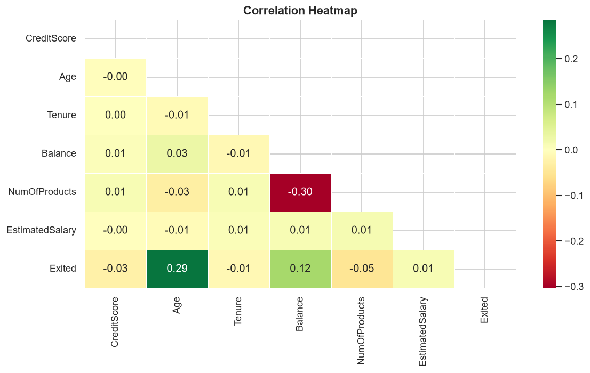
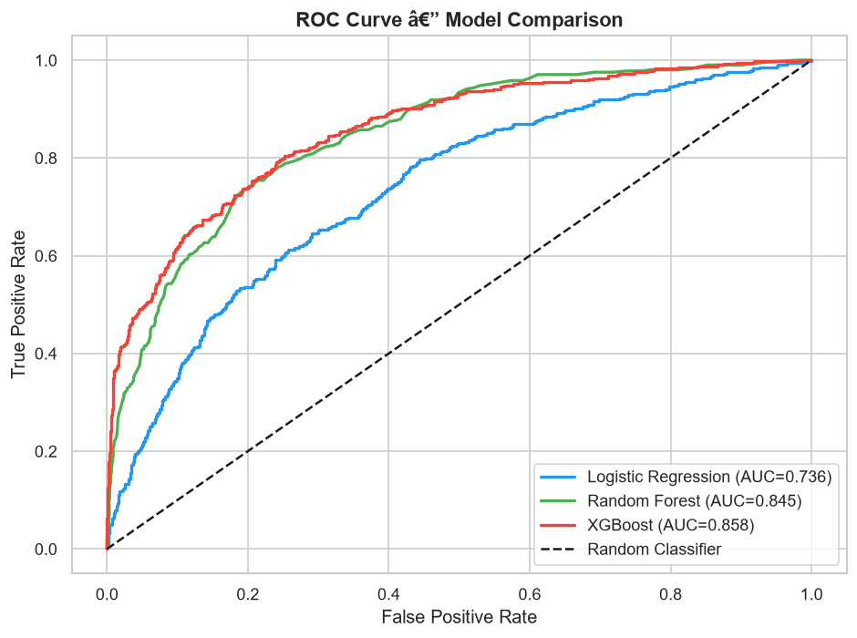
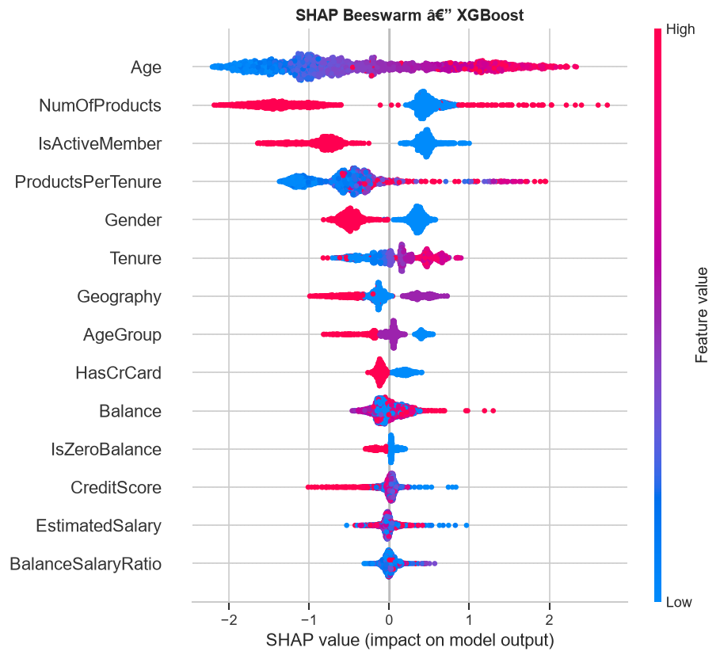

# 🏦 Bank Customer Churn Prediction

A complete end-to-end Machine Learning project to predict which bank customers are likely to churn, using classification models, SMOTE for class imbalance, and SHAP values for model interpretability.

## 📁 Project Structure

```
churn-prediction/
├── data/
│   └── Churn_Modelling.csv     # dataset from Kaggle
├── model/                      # auto-generated after running script
│   ├── best_model.pkl
│   ├── scaler.pkl
│   └── features.pkl
├── plots/                      # auto-generated visualizations
├── churn_prediction.py         # main analysis script
├── requirements.txt
└── README.md
```

## 🚀 Getting Started

### 1. Install dependencies
```bash
pip install -r requirements.txt
```

### 2. Prepare the dataset
Download from Kaggle: [Bank Customer Churn Prediction](https://www.kaggle.com/datasets/shantanudhakadd/bank-customer-churn-prediction)

Save as `data/Churn_Modelling.csv`

### 3. Create plots folder
```bash
mkdir plots
```

### 4. Run the analysis
```bash
python churn_prediction.py
```

## 🛠️ Tech Stack

- **Models:** Logistic Regression, Random Forest, XGBoost
- **Imbalanced Data:** SMOTE (imbalanced-learn)
- **Interpretability:** SHAP values
- **Visualization:** Matplotlib, Seaborn
- **Evaluation:** ROC-AUC, Precision-Recall, Confusion Matrix

## 📊 What This Project Covers

- Exploratory Data Analysis (EDA) with churn rate by feature
- Feature engineering (BalanceSalaryRatio, AgeGroup, IsZeroBalance, etc.)
- Handling class imbalance with SMOTE
- Model comparison: Logistic Regression vs Random Forest vs XGBoost
- Evaluation with ROC-AUC, Precision-Recall curve, Confusion Matrix
- SHAP values for model interpretability (global + local explanation)
- Business recommendations based on model insights

## 💡 Key Insights

- **Age** is the strongest churn predictor — older customers (45-60) churn significantly more
- **Inactive members** are at much higher risk of churning
- **Germany** customers churn more than France and Spain
- Customers with **zero balance** show elevated churn risk
- **3-4 products** customers churn more than those with 1-2 products

### Result


### ROC Curve


### SHAP Beeswarm


## 👤 Author

**Kevinz Adhi Anggoro**
Data Science Bootcamp Graduate Batch 56 — Digital Skola

## 📬Contact Me 
If you have any questions, development suggestions, or collaboration opportunities, please feel free to contact me via:

**LinkedIn:** [Kevinz Adhi Anggoro](https://linkedin.com/in/Kevinzadhi)
**Email:** kevinadhi11@gmail.com